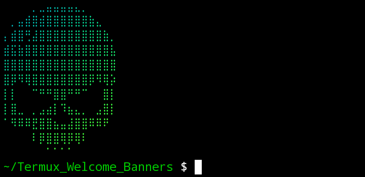
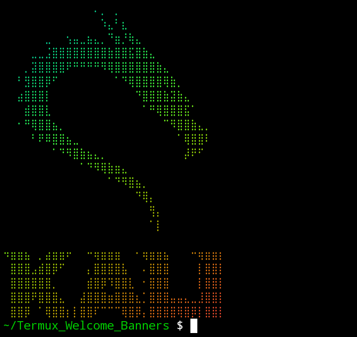
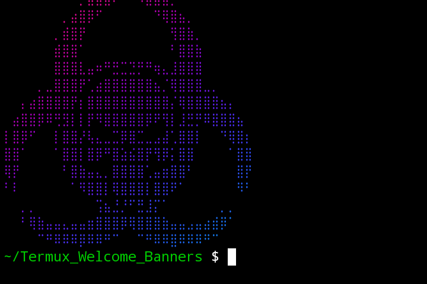
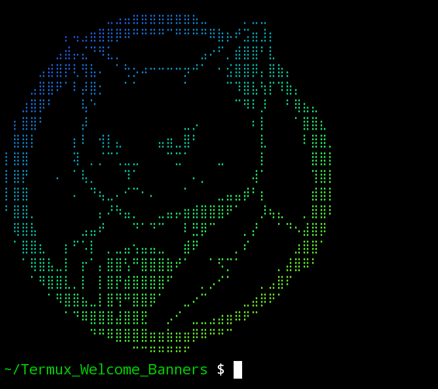
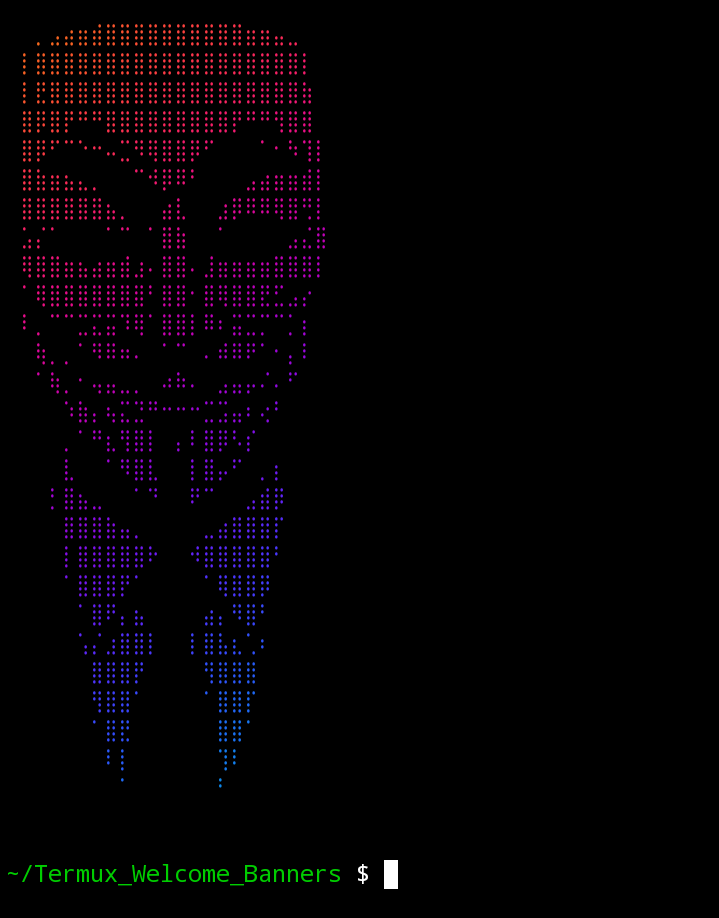

# Termux_Welcome_Banners
# version: 1.0.0

# 🎨 Termux Welcome Banner Changer

A simple but powerful **Termux tool** to change your **welcome / startup banner** and make your Termux look clean, stylish, and unique.

---

## ✨ Features
- 🔥 Custom welcome banner
- 🖼 ASCII text / banner support
- ⚡ Fast & lightweight
- 🧑‍💻 Beginner-friendly
- 🛠 Works on all Termux versions

---
## 🧰 Requirements
- Termux (latest version recommended)
- Android device
- Internet connection (first time installation only)
- Basic knowledge of Termux commands


## 📢 Disclaimer
This tool is made for **educational and customization purposes only**.

The author is **not responsible** for any damage, data loss, or issues caused
by improper use of this tool.  
Use it at your own risk.


# Termux
```

git clone https://github.com/Speed494/Termux_Welcome_Banners
cd Termux_Welcome_Banners
bash Install.sh
chmod +x welcomeb.sh
./welcomeb.sh
```

## 📸 Preview
Devil


PC Hacker Style


Skull Style


Kali Style


Random Style



Random Style



Hacker Style



## 🛡 License
This project is licensed under the **MIT License**.

You are free to:
- Use this tool
- Modify the source code
- Share or distribute it
- Use it for personal or commercial purposes

As long as you give proper credit to the original author.


## 🤝 Contribution
Contributions are welcome! 🚀

If you want to improve this project:
1. Fork this repository
2. Make your changes
3. Create a Pull Request

Bug reports, feature suggestions, and improvements are always appreciated.


