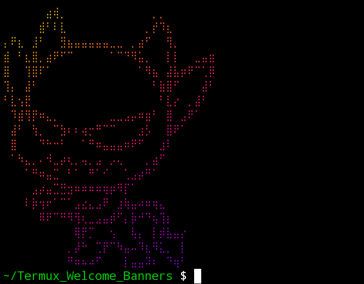
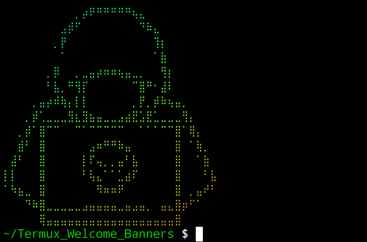

# Termux_Welcome_Banners
# version: 1.0.0

# 🎨 Termux Welcome Banner Changer

A simple but powerful **Termux tool** to change your **welcome / startup banner** and make your Termux look clean, stylish, and unique.

---

## ✨ Features
- 🔥 Custom welcome banner
- 🖼 ASCII text / banner support
- ⚡ Fast & lightweight
- 🧑‍💻 Beginner-friendly
- 🛠 Works on all Termux versions

---


```
pkg install ruby && gem install lolcat
git clone https://github.com/Speed494/Termux_Welcome_Banners
cd Termux_Welcome_Banners
chmod +x welcomeb.sh
./welcomeb.sh
```

## 📸 Preview
Devil


PC Hacker Style

